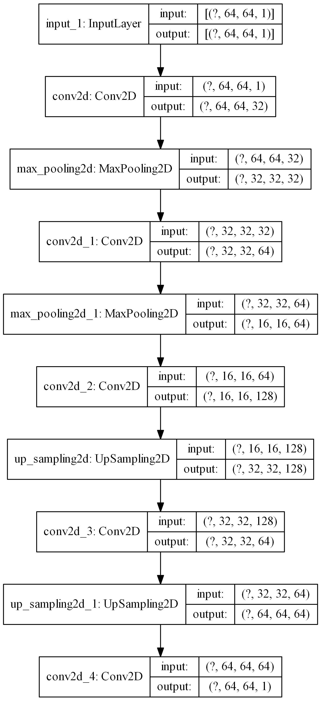
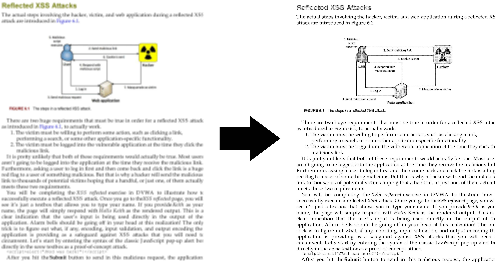
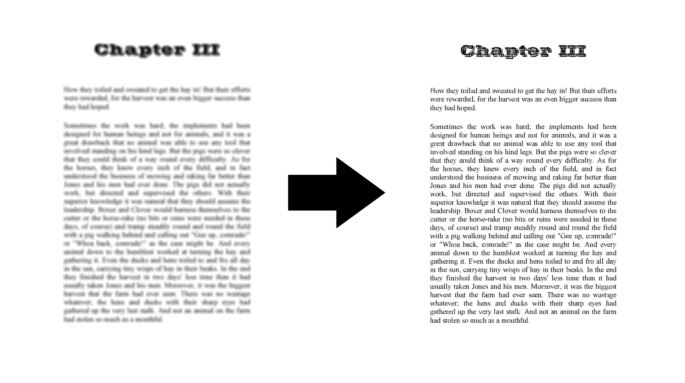

# Topic
Recognizing Blurred Documents (RBD)

# Abstract
The model is an autoencoder convolutional network created by Keras in Python using the TensorFlow library. One of the advantages of this project is that it can recognize images of various sizes. It works by taking images of any size and converting them into 64x64 pieces, then recognizing these pieces, then connecting them together to display the final image.

# Links
[Github](https://github.com/AryaKoureshi/RBD)

[Linkedin](https://www.linkedin.com/posts/arya-koureshi_deeplearning-python-tensorflow-activity-6707914099294003201-5eM2)

# Model
#### [modelRBDNew64x64.h5](modelRBDNew64x64.h5)

  

# Results

  

